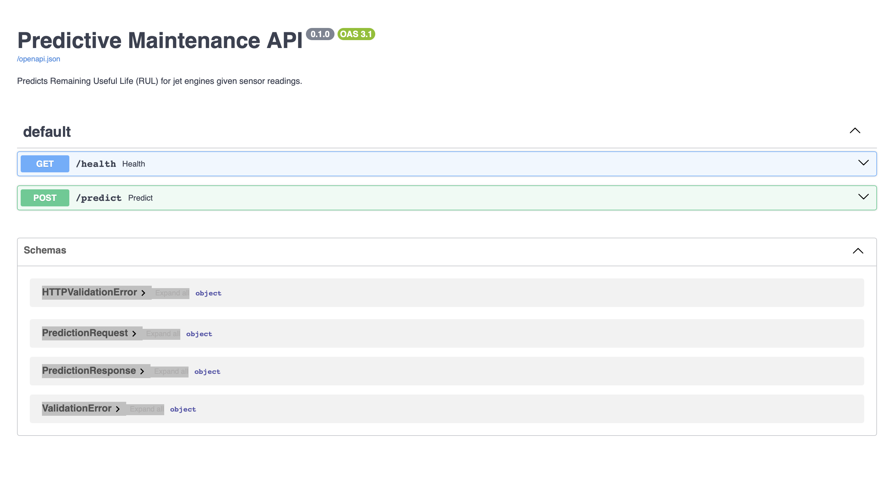
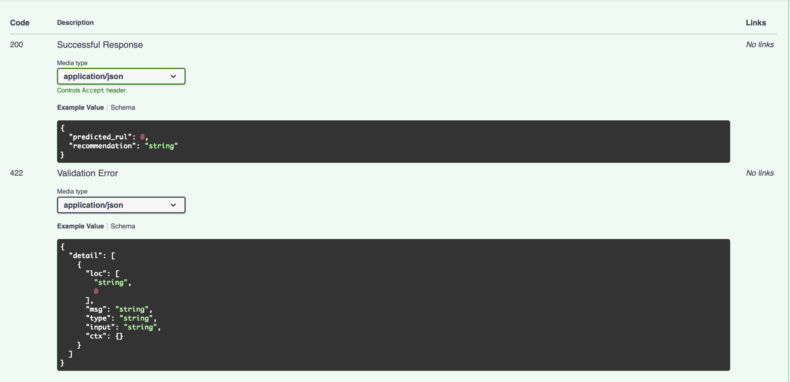

# Predictive Maintenance Platform

[](https://github.com/Izzy0516/predictive-maintenance-platform/actions/workflows/tests.yml)

## The system at a glance

**Interactive API documentation, auto-generated by FastAPI:**



**The /predict endpoint accepts sensor readings and returns a predicted RUL:**



---

Predicting Remaining Useful Life (RUL) on jet engine sensor data with tree-based regression, engine-grouped cross-validation, and a FastAPI serving layer.

**Best result: RMSE 17.9 on the held-out `test_FD001` set inside the published FD001 benchmark range.**

---

## Why this project

Remaining Useful Life prediction is the modelling task behind component life management in motorsport (gearbox change rules in F1, ERS component lifetimes, power unit life budgets) and industrial predictive maintenance. The problem shape — sensor time series → regression on a survival-adjacent target, is a compact demonstration of standard ML engineering: data cleaning, feature engineering, model selection, honest evaluation, serving, and testing.

---

## Results

Held-out evaluation on the untouched `test_FD001.txt` (100 engines, one prediction per engine at the last recorded cycle):

| Model | RMSE | NASA score |
|---|---|---|
| Mean baseline | 41.94 | 33,354 |
| Ridge regression | 21.03 | 1,337 |
| Random Forest | 18.26 | 1,149 |
| **HistGradientBoosting** | **17.93** | **865** |

Gradient boosting's 17.93 RMSE is comparable to the Saxena et al. (2008) benchmark of 18.4 on this dataset. All four models were also evaluated with 5-fold engine-grouped cross-validation on the training set to confirm generalisation (see `notebooks/02_baseline_model.ipynb`).

**Rank ordering on the NASA score differs from cross-validation:** Ridge was the NASA winner in CV (because tree ensembles' averaging bias hurt them on near-failure rows), but Gradient Boosting wins on the held-out set (where predictions are on the last cycle of each engine, mostly healthy). The best model depends on the operational regime — a point developed further in the [project guide](PROJECT_GUIDE.md).

---

## Method — the decisions worth defending

Three technical choices shape everything downstream. Each is enforced by a test so it can't be silently broken.

**1. RUL clipping at 125 cycles.** RUL is unmeasurable directly; we reconstruct it retrospectively from run-to-failure data. But raw RUL asks the model to distinguish healthy engines with 190 cycles left from healthy engines with 210 cycles left — a task the sensors can't support, because degradation hasn't started. Following Heimes (2008), the target is clipped at 125, encoding a piecewise-linear degradation assumption. Pearson correlations between sensors and RUL are 4–5× stronger in the degraded region than the healthy region, which supports the choice.

**2. Engine-grouped train/test splits.** Rows within one engine are highly correlated: cycle 87 and cycle 88 are nearly identical readings. A naive `train_test_split` gives fake RMSE around 12–14 on FD001 because ~20% of every engine's rows land in test. `GroupKFold` on `engine_id` mirrors deployment: the model is evaluated on engines it has never seen.

**3. Two metrics, always reported together.** RMSE is symmetric; the NASA C-MAPSS scoring function penalises late predictions (predicted RUL > true RUL) exponentially with denominator 10 and early predictions with denominator 13. A 30-cycle-late error costs `exp(3) − 1 ≈ 19.09`; a 30-cycle-early error costs `exp(30/13) − 1 ≈ 9.05`. Roughly 2× the penalty for being late, reflecting the operational cost of missing an imminent failure. Reporting only RMSE hides the failure mode that matters most.

Full derivation of these decisions with supporting evidence is in [`PROJECT_GUIDE.md`](PROJECT_GUIDE.md).

---

## The API

A FastAPI service exposes the trained model over HTTP:

```
POST /predict
{
  "features": {
    "s2": 642.15,
    "s3": 1591.82,
    ...
  }
}

→
{
  "predicted_rul": 34.2,
  "recommendation": "schedule_inspection"
}
```

`GET /health` returns a liveness check. Interactive OpenAPI docs are auto-generated at `/docs` when the service is running.

Input validation is enforced by Pydantic; missing training features return HTTP 400 with a helpful message; the recommendation layer (`healthy`, `schedule_inspection`, `immediate_inspection`) is threshold-based on predicted RUL.

---

## Repo layout

```
predictive-maintenance-platform/
├── src/
│   ├── metrics.py         RMSE and NASA C-MAPSS scoring
│   ├── data.py            load, RUL, per-engine rolling features
│   ├── splits.py          engine-grouped train/test splits
│   ├── models.py          MeanRULBaseline, Ridge, RandomForest, GradientBoosting
│   ├── train.py           trains the production model and persists to disk
│   └── api.py             FastAPI service with /predict and /health
├── tests/                 39 tests covering metrics, data, splits, models, API
├── notebooks/
│   ├── 01_exploratory_data_analysis.ipynb
│   ├── 02_baseline_model.ipynb       model comparison with CV
│   └── 03_final_evaluation.ipynb     held-out test set results
├── data/
│   ├── raw/               C-MAPSS files (gitignored — download from Kaggle)
│   └── processed/         intermediate CSVs
├── PROJECT_GUIDE.md       detailed theory and decisions
├── requirements.txt
└── README.md
```

Modules under `src/` contain the code that has to run repeatably. Notebooks consume `src/` and produce findings. Every downstream file (API, evaluation notebook, tests) uses the same `load_and_engineer` pipeline — there is one place to change any given piece of logic.

---

## Testing

39 tests, all passing. They pin down design decisions rather than incidental behaviour:

- **Metrics**: perfect predictions score 0; RMSE is symmetric in sign; NASA score is asymmetric (late > early); NASA aggregates by sum, not mean.
- **Data pipeline**: RUL is 0 at the last cycle of each engine; RUL clipping caps the healthy region; rolling windows never bleed across engines; no NaN rows after feature engineering (`min_periods=1`).
- **Splits**: no engine appears in both train and test of any fold; every row appears in exactly one test fold; the splitter fails loudly on bad input.
- **Models**: baseline RMSE equals `std(y)`; Ridge beats baseline on data with signal; Ridge pipeline includes the scaler step; gradient boosting beats baseline.
- **API**: `/health` returns 200; `/predict` returns the expected shape; missing features → 400; malformed body → 422; recommendations are consistent with predicted RUL thresholds.

Run with `pytest -v`.

---

## Running it locally

```bash
# 1. Set up
python -m venv .venv
source .venv/bin/activate
pip install -r requirements.txt

# 2. Get the data
# Download CMaps.zip from
#   https://www.kaggle.com/datasets/behrad3d/nasa-cmaps
# Unzip and place train_FD001.txt, test_FD001.txt, RUL_FD001.txt
# into data/raw/

# 3. Run tests
pytest -v

# 4. Train and persist the model
python -m src.train

# 5. Start the API
uvicorn src.api:app --reload

# 6. In your browser
# http://127.0.0.1:8000/docs   — interactive API docs
# http://127.0.0.1:8000/health — liveness check
```

---

## What is deliberately out of scope

- **No frontend.** A React dashboard was in the original scope; it would be architecture theatre for a project where nothing needs to persist between requests. The `/docs` page is a fully interactive interface to the model.
- **No database.** State lives in the model file on disk. Adding Postgres for a stateless prediction service would be complexity without value.
- **Not fine-tuned to state-of-the-art.** The target was to hit the published FD001 benchmark range (~18 RMSE) with defensible methodology, not to beat it. Beating the benchmark takes deep learning and months of tuning; matching it demonstrates competence.
- **FD001 only.** FD002–004 add multiple operating conditions and require condition-normalisation preprocessing — real follow-up work, but out of scope for a single-dataset baseline.

---

## Reference

Saxena, A., Goebel, K., Simon, D., & Eklund, N. (2008). *Damage propagation modeling for aircraft engine run-to-failure simulation.* PHM 2008.
